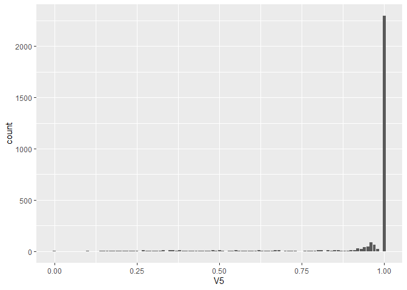
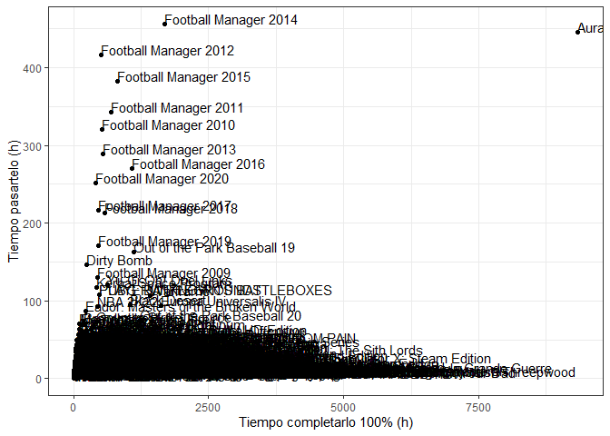
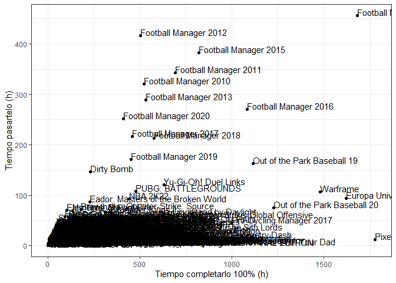
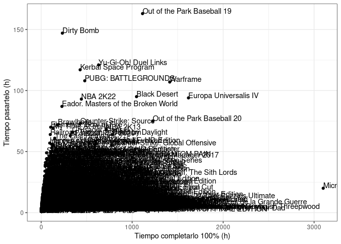
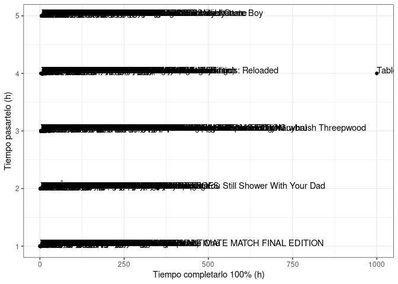

# **NextGame project - Metadata Analysis** 

## marko_pakete Steam Library data

· Number of listed Apps

``` r
dim(datos)[1]
```

    ## [1] 3162

· Total time to finish library

``` r
paste(sum(as.numeric(datos[datos[,3]!="No time registered yet" & !is.na(datos[,3]),3])),"h")
```

    ## [1] "28142 h"

``` r
paste(round(sum(as.numeric(datos[datos[,3]!="No time registered yet" & !is.na(datos[,3]),3]))/24/30/12,digits = 2),"years")
```

    ## [1] "3.26 years"

· Average time to finish a game

``` r
paste(round(mean(as.numeric(datos[datos[,3]!="No time registered yet" & !is.na(datos[,3]),3])),digits = 2),"h")
```

    ## [1] "11.58 h"

``` r
ggplot(datos[datos[,3]!="No time registered yet" & !is.na(datos[,3]) & datos[,3]>0,], aes(x=factor(V3, level=seq(min(as.numeric(datos[datos[,3]!="No time registered yet" & !is.na(datos[,3]),3])),max(as.numeric(datos[datos[,3]!="No time registered yet" & !is.na(datos[,3]),3])),1)))) + geom_histogram(stat = "count") + theme_bw() + theme(axis.text.x = element_text(angle=90, hjust=1)) + ylab("Games count") + xlab("Time to finish")
```

    ## Warning in geom_histogram(stat = "count"): Ignoring unknown parameters:
    ## `binwidth`, `bins`, and `pad`

<!-- -->
· Average time to 100% complete a game

``` r
paste(round(mean(as.numeric(datos[datos[,4]!="No time registered yet" & !is.na(datos[,4]),4])),digits = 2),"h")
```

    ## [1] "42.23 h"

· Total time to 100% complete library

``` r
paste(sum(as.numeric(datos[datos[,4]!="No time registered yet" & !is.na(datos[,4]),4])),"h")
```

    ## [1] "102615 h"

``` r
paste(round(sum(as.numeric(datos[datos[,4]!="No time registered yet" & !is.na(datos[,4]),4]))/24/30/12,digits = 2),"years")
```

    ## [1] "11.88 years"

## HowLongToBeat method accuracy

We analyze the accuracy of the HowLongToBeat methodology. Each hit to
the database is related to a similarity index.

First we need to know the number of games to which we have found a
result in the database when calling their name with the API. This data
is analyzed from the “Full” metadata table.

``` r
print(dim(datos[!is.na(datos$V3) &  !is.na(datos$V4),])[1])
```

    ## [1] 2870

From the total number we can see the similarity distribution.

``` r
ggplot(datos,aes(V5)) + geom_bar()
```

<!-- -->

Being the total number of exact matches (similarity = 1)

``` r
print(dim(datos[datos$V5==1,])[1])
```

    ## [1] 2588

Focusing on the games that aren’t similaryt=1 we can highlight the
“problems”. Lets focus on each case an their closest result

``` r
datos[datos$V5<1,c(1,2,5)][1:20,]
```

    ##                                            V1
    ## 14                                 Magic 2015
    ## 23       Plants vs. Zombies: Game of the Year
    ## 25        The Whispered World Special Edition
    ## 35         Darksiders II Deathinitive Edition
    ## 37                            Battle vs Chess
    ## 40               Hellblade: Senua's Sacrifice
    ## 59                                    Saviors
    ## 66                    Jotun: Valhalla Edition
    ## 70                Wasteland 2: Director's Cut
    ## 79           Monkey Island 2: Special Edition
    ## 89       Broken Sword 3 - the Sleeping Dragon
    ## 90                       DuckTales Remastered
    ## 91                  Resident Evil Revelations
    ## 93                                 Hell Yeah!
    ## 94             Dead Island Definitive Edition
    ## 98              Shovel Knight: Treasure Trove
    ## 103     Planescape: Torment: Enhanced Edition
    ## 104                                99 Spirits
    ## 106     Sherlock Holmes: The Devil's Daughter
    ## 110 Injustice: Gods Among Us Ultimate Edition
    ##                                                         V2   V5
    ## 14  Magic: The Gathering - Duels of the Planeswalkers 2015 0.19
    ## 23                                      Plants vs. Zombies 0.50
    ## 25                                     The Whispered World 0.54
    ## 35                     Darksiders II: Deathinitive Edition 0.97
    ## 37                                        Battle vs. Chess 0.94
    ## 40                            Hellblade: Senua's Sacrifice 0.96
    ## 59               The Ninja Saviors: Return of the Warriors 0.20
    ## 66                                                   Jotun 0.22
    ## 70                                             Wasteland 2 0.41
    ## 79                      Monkey Island 2: LeChuck's Revenge 0.56
    ## 89                       Broken Sword: The Sleeping Dragon 0.97
    ## 90                                   DuckTales: Remastered 0.95
    ## 91                              Resident Evil: Revelations 0.96
    ## 93                     Hell Yeah! Wrath of the Dead Rabbit 0.29
    ## 94                         Dead Island: Definitive Edition 0.97
    ## 98                                           Shovel Knight 0.45
    ## 103                                    Planescape: Torment 0.95
    ## 104                                            Tsukumogami 0.00
    ## 106                  Sherlock Holmes: The Devil's Daughter 0.97
    ## 110            Injustice: Gods Among Us - Ultimate Edition 0.95

So as we can see, most “problems” are derived from typos, such as “:” o
romanic values

## Recomended and forbiden games for achivement collectors

If you are a completionist you would like to play games that are easy to
100% complete. This is not only the shorttest games, but the games that
could be easily completed just playing (avoiding in the majority of
cases farming/grinding games). The representation of the time to beat
against the time t beat at 100% could shade lights on this question

``` r
datos_lim<-datos[datos[,3]!="No time registered yet",] # We remove the entries with not time regisrered yet
datos_lim[,3]<-as.numeric(datos_lim[,3]) 
datos_lim[,4]<-as.numeric(datos_lim[,4])

datos_lim<-datos_lim[datos_lim[,3]>0,] # We remove the 0 hours game
datos_lim<-datos_lim[datos_lim[,4]>0,]

ggplot(datos_lim, aes(V4,V3,label=V1)) + geom_point() + theme_bw() + geom_text(hjust=0, vjust=0) + ylab("Tiempo pasartelo (h)") + xlab("Tiempo completarlo 100% (h)")
```

<!-- -->

A lot of sport simulation games, concretely Football Manager games, and
Aura Kingdom are the games that show the most biased distribution when
comparing both parameters, based in farming and repetition. Football
Manager games surround 1000h of game play to complete it at a 100%,
while Aura Kingdom, a MMO, is up to 9000h to finish it. It is easy to
think on these as farming related achievements that will take an insane
amount of time.

But we can see much using this kind of approach, so we better create a
index to save the games that are more biased according to the difference
beeteen finished and 100% games

``` r
datos_lim$time_index<-datos_lim$V4/datos_lim$V3

datos_lim <- datos_lim[order(as.factor(datos_lim$time_index),decreasing = T),]
datos_lim$V1 <- reorder(datos_lim$V1, -datos_lim$time_index)

#time_rel<-datos_lim[order(datos_lim$time_index,decreasing=TRUE),]

#ggplot(time_rel[1:5,],aes(V1,time_index)) + geom_bar()

ggplot(datos_lim[1:20,], aes(V1,time_index,label=V1)) + geom_bar(stat = "identity") + theme_bw() + theme(axis.text.x = element_text(angle=90, hjust=1))
```

<!-- -->

The same way, we can take a look to the fastest game to complete,
looking at game with the lowest index

``` r
datos_lim <- datos_lim[order(as.factor(datos_lim$time_index),decreasing = F),]
datos_lim$V1 <- reorder(datos_lim$V1, -datos_lim$time_index)

#time_rel<-datos_lim[order(datos_lim$time_index,decreasing=TRUE),]

#ggplot(time_rel[1:5,],aes(V1,time_index)) + geom_bar()

#ggplot(datos_lim[1:30,], aes(V1,time_index,label=V1)) + geom_bar(stat = "identity") + theme_bw() + theme(axis.text.x = element_text(angle=90, hjust=1))

paste("Number of games that can be 100% achieved by finishing it:",length(na.omit(datos_lim[datos_lim$time_index==1,1])))
```

    ## [1] "Number of games that can be 100% achieved by finishing it: 134"

``` r
as.character(na.omit(datos_lim[datos_lim$time_index==1,1])[1:30])
```

    ##  [1] "Broken Sword 3 - the Sleeping Dragon"        
    ##  [2] "The Room 4: Old Sins"                        
    ##  [3] "Albedo: Eyes from Outer Space"               
    ##  [4] "Belladonna"                                  
    ##  [5] "Spoiler Alert"                               
    ##  [6] "qop 2"                                       
    ##  [7] "Sakura Magical Girls"                        
    ##  [8] "Mystery Masters: Psycho Train Deluxe Edition"
    ##  [9] "Sakura Beach"                                
    ## [10] "Survival Zombies The Inverted Evolution"     
    ## [11] "Cyber City 2157: The Visual Novel"           
    ## [12] "Zup! 6"                                      
    ## [13] "The Room"                                    
    ## [14] "Castle of no Escape"                         
    ## [15] "DarkBase 01"                                 
    ## [16] "Sweet fantasy"                               
    ## [17] "Calcu-Late"                                  
    ## [18] "Machine Hunt"                                
    ## [19] "Unhack"                                      
    ## [20] "Zup! 7"                                      
    ## [21] "Broken Dreams"                               
    ## [22] "The Vanishing of Ethan Carter"               
    ## [23] "To the Moon"                                 
    ## [24] "Apartment 666"                               
    ## [25] "The Room Two"                                
    ## [26] "Oknytt"                                      
    ## [27] "The Norwood Suite"                           
    ## [28] "Kathy Rain"                                  
    ## [29] "Insincere"                                   
    ## [30] "qop"

We can order this information by user positive rating

``` r
datos_lim <- datos_lim[(datos_lim[,12]+datos_lim[,13])>=100,]
datos_lim <- datos_lim[order(as.factor(round((datos_lim[,12]/(datos_lim[,12]+datos_lim[,13]))*100,digits=1)),decreasing = T),]
datos_lim$V1 <- reorder(datos_lim$V1, -datos_lim$time_index)

datos_lim$rating <- as.factor(round((datos_lim[,12]/(datos_lim[,12]+datos_lim[,13]))*100,digits=1))
#time_rel<-datos_lim[order(datos_lim$time_index,decreasing=TRUE),]

#ggplot(time_rel[1:5,],aes(V1,time_index)) + geom_bar()

#ggplot(datos_lim[1:30,], aes(V1,time_index,label=V1)) + geom_bar(stat = "identity") + theme_bw() + theme(axis.text.x = element_text(angle=90, hjust=1))

out<-datos_lim[datos_lim$time_index==1,][1:30,c(1,11,14,19,26)]
colnames(out)<-c("Name","Genre","Developer","Release date","Positive rating")
out
```

    ##                                          Name
    ## 157                      The Room 4: Old Sins
    ## 789                              The Room Two
    ## 447                                  The Room
    ## 1161                                   Zup! F
    ## 1230                          The Expendabros
    ## 718                               To the Moon
    ## 1227                                   Zup! 9
    ## 2634                         Rusty Lake Hotel
    ## 648                                    Zup! 7
    ## 879                                    Zup! 2
    ## 342                                     qop 2
    ## 2832               Tales from the Borderlands
    ## 2400                  Oddworld: Abe's Exoddus
    ## 3150                              Zup! Zero 2
    ## 435                                    Zup! 6
    ## 2946                         Thomas Was Alone
    ## 958                                    Zup! 5
    ## 2907                         The Office Quest
    ## 1180                                Zup! Zero
    ## 2863 The Awesome Adventures of Captain Spirit
    ## 825                                Kathy Rain
    ## 799                                    Oknytt
    ## 2485                         Press Any Button
    ## 1235          Resident Evil 2 \\1-Shot Demo\\
    ## 830                                       qop
    ## 2068                             Hector: Ep 3
    ## 2218                           Lines Infinite
    ## 839                            Dreaming Sarah
    ## 2645         Sam & Max 102: Situation: Comedy
    ## 1573                               Big Dipper
    ##                                       Genre
    ## 157                               Adventure
    ## 789                        Adventure, Indie
    ## 447                        Adventure, Indie
    ## 1161                          Casual, Indie
    ## 1230 Action, Adventure, Free to Play, Indie
    ## 718                   Adventure, Indie, RPG
    ## 1227                          Casual, Indie
    ## 2634                       Adventure, Indie
    ## 648                           Casual, Indie
    ## 879                           Casual, Indie
    ## 342                           Casual, Indie
    ## 2832                              Adventure
    ## 2400                              Adventure
    ## 3150                          Casual, Indie
    ## 435                           Casual, Indie
    ## 2946                                  Indie
    ## 958                           Casual, Indie
    ## 2907                       Adventure, Indie
    ## 1180                          Casual, Indie
    ## 2863                Adventure, Free to Play
    ## 825                        Adventure, Indie
    ## 799                        Adventure, Indie
    ## 2485                          Casual, Indie
    ## 1235                                 Action
    ## 830                           Casual, Indie
    ## 2068                      Adventure, Casual
    ## 2218                Casual, Indie, Strategy
    ## 839                Adventure, Casual, Indie
    ## 2645                      Action, Adventure
    ## 1573                      Indie, Simulation
    ##                                   Developer Release date Positive rating
    ## 157                         Fireproof Games  11-Feb-2021            98.8
    ## 789                         Fireproof Games  05-Jul-2016            97.8
    ## 447                         Fireproof Games  28-Jul-2014            97.7
    ## 1161                            Quiet River  11-Dec-2019            97.3
    ## 1230                             Free Lives  05-Aug-2014            97.2
    ## 718                          Freebird Games  07-Sep-2012            96.4
    ## 1227                            Quiet River  24-Jun-2019            95.8
    ## 2634                             Rusty Lake  29-Jan-2016            95.8
    ## 648                             Quiet River  12-Dec-2017            95.6
    ## 879                             Quiet River  05-Dec-2016            95.6
    ## 342                             Quiet River  12-Dec-2017            95.3
    ## 2832                         Telltale Games  16-Feb-2021            95.2
    ## 2400                   Oddworld Inhabitants  28-Aug-2008              95
    ## 3150                            Quiet River  11-Sep-2018            94.8
    ## 435                             Quiet River  19-Sep-2017            94.5
    ## 2946                          Bithell Games  12-Nov-2012            93.9
    ## 958                             Quiet River  13-Jun-2017            93.8
    ## 2907                                11Sheep  24-May-2018            93.7
    ## 1180                            Quiet River  06-Apr-2017            93.6
    ## 2863                  DONTNOD Entertainment  25-Jun-2018            92.7
    ## 825                          Clifftop Games  05-May-2016            92.6
    ## 799                   Nemoria Entertainment  04-Apr-2014            92.3
    ## 2485                           Eugene Zubko  07-Jan-2021            92.3
    ## 1235                       CAPCOM Co., Ltd.         <NA>            92.1
    ## 830                             Quiet River  13-Jul-2017            91.6
    ## 2068                               Telltale  27-Apr-2011            91.3
    ## 2218                           Konstructors  24-Nov-2017            91.3
    ## 839  Asteristic Game Studio, Anthony Septim  12-Mar-2015            91.1
    ## 2645                         Telltale Games  15-Jun-2007            91.1
    ## 1573                             Team Zimno  07-Jan-2019            90.8

These are the best rated game to entirele complete in a single run

If we remove these games we could focus on the next most biased games

``` r
datos_lim<-datos_lim[!grepl("Football Manager",datos_lim[,1]) & datos_lim[,1]!="Aura Kingdom",]

ggplot(datos_lim, aes(V4,V3,label=V1)) + geom_point() + theme_bw() + geom_text(hjust=0, vjust=0) + ylab("Tiempo pasartelo (h)") + xlab("Tiempo completarlo 100% (h)")
```

<!-- -->

Even after removing those games, there are still plenty of games biased
to the 100% completion rate. Now we can see othe sport games, such as
NBA and Our of the park games, in company with MMO titles like Black
Desert, on the top of the figure. After removing them we can see other
games. These games are the more time demanding game, for finishing and
completion, but not the most biased games. To get the names of the most
based game we should focus on the games that have a really low time to
complete (less than 5h) but insane time for 100% finishing.

``` r
datos_lim<-datos_lim[datos_lim$V3<=5,]

ggplot(datos_lim, aes(V4,V3,label=V1)) + geom_point() + theme_bw() + geom_text(hjust=0, vjust=0) + ylab("Tiempo pasartelo (h)") + xlab("Tiempo completarlo 100% (h)")
```

<!-- -->

This representation is not the best option for lloking at the data,
let’s represent it as barplots

``` r
datos_lim<-datos_lim[datos_lim$V3<=1,]

ggplot(datos_lim, aes(V3,V4,label=V1)) + geom_jitter(position = position_jitter(seed = 1)) + geom_text(position = position_jitter(seed = 1)) + theme_bw()
```

<!-- -->
This way you can take a closer look at games that will only take an hour
to finish, most of them Arcade games, but will take up to 80 hours to
finish completely, in the case of King of Fighters ’98 Ultimate Match
Final Edition. (ESTO ES MEJOR HACER BoxPlot y mostrar solo los puntos
que sean outlier…cómo?)

################################# Analyze Steam_library

datos\<-read.delim(“Steam_Library_Metadata_marko_pakete.txt”,header = T)

###### N?mero de juegos, tiempo total de juego, tiempo medio de juego, conteo de generos, puntuaci?n media y desviaci?n, n?mero de juegos por develop y publisher

\#Number of entries

print(dim(datos)\[1\])

# Time to finish library

datos_lim\<-datos\[datos\[,3\]!=“No time registered yet” &
!is.na(datos\[,3\]),\] datos_lim\[,3\]\<-as.numeric(datos_lim\[,3\])
datos_lim\[,4\]\<-as.numeric(datos_lim\[,4\])

datos_lim\<-datos_lim\[datos_lim\[,3\]\>0,\]
datos_lim\<-datos_lim\[datos_lim\[,4\]\>0,\]

print(paste0(((sum(datos_lim\$V3)/24)/31)/12,” years”))

# Time to COMPLETE library

datos_lim\<-datos\[datos\[,4\]!=“No time registered yet” &
!is.na(datos\[,4\]),\] datos_lim\[,3\]\<-as.numeric(datos_lim\[,3\])
datos_lim\[,4\]\<-as.numeric(datos_lim\[,4\])

datos_lim\<-datos_lim\[datos_lim\[,3\]\>0,\]
datos_lim\<-datos_lim\[datos_lim\[,4\]\>0,\]

print(paste0(((sum(datos_lim\$V4)/24)/31)/12,” years”))

\######Tiempo medio

datos_lim\<-datos\[datos\[,8\]!=“No time registered yet” &
!is.na(datos\[,8\]),\] datos_lim\[,8\]\<-as.numeric(datos_lim\[,8\])
datos_lim\<-datos_lim\[datos_lim\[,8\]\>0,\]

mean(datos_lim\[,8\])

######## Pensar c?mo representar valoraci?n de los juegos por compa??a y por a?o

factor(datos\$V14)

heatmap(datos$V15,datos$V14)

#################### 

## R Markdown

This is an R Markdown document. Markdown is a simple formatting syntax
for authoring HTML, PDF, and MS Word documents. For more details on
using R Markdown see <http://rmarkdown.rstudio.com>.

When you click the **Knit** button a document will be generated that
includes both content as well as the output of any embedded R code
chunks within the document. You can embed an R code chunk like this:

``` r
summary(cars)
```

    ##      speed           dist       
    ##  Min.   : 4.0   Min.   :  2.00  
    ##  1st Qu.:12.0   1st Qu.: 26.00  
    ##  Median :15.0   Median : 36.00  
    ##  Mean   :15.4   Mean   : 42.98  
    ##  3rd Qu.:19.0   3rd Qu.: 56.00  
    ##  Max.   :25.0   Max.   :120.00

## Including Plots

You can also embed plots, for example:

<!-- -->

Note that the `echo = FALSE` parameter was added to the code chunk to
prevent printing of the R code that generated the plot.
