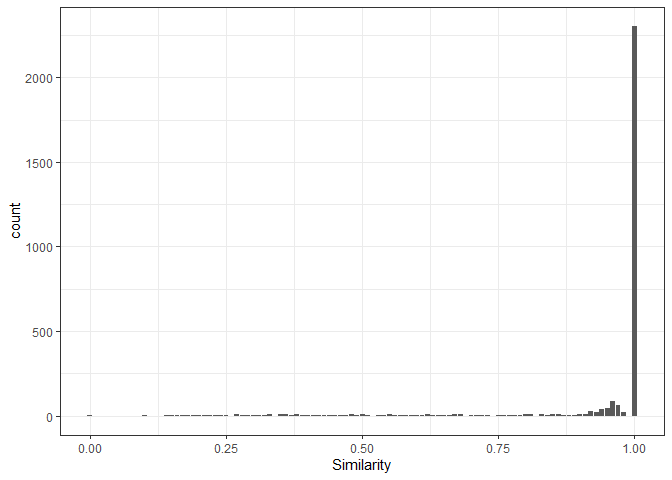
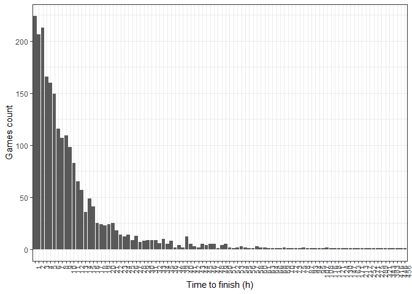
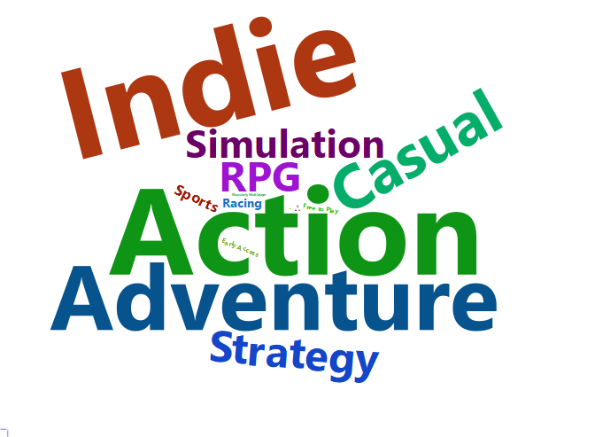
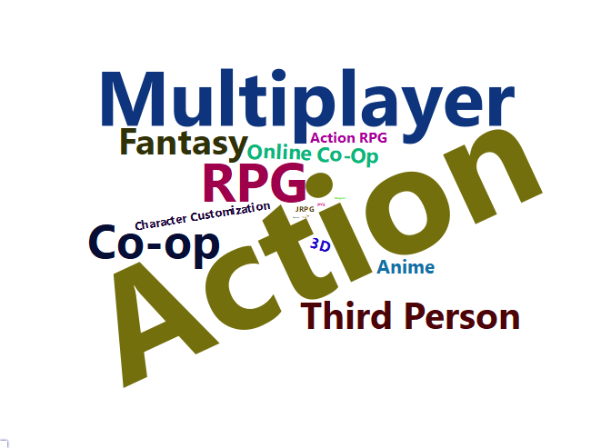
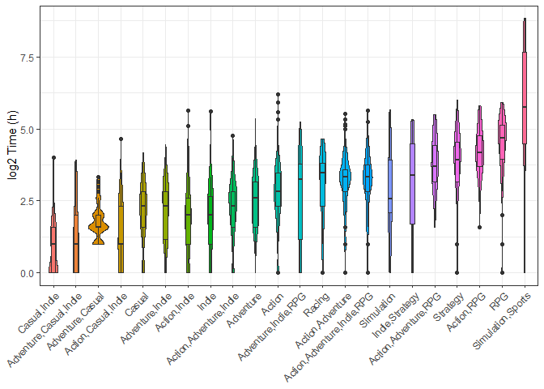

# **NextGame project - Metadata Analysis** 

The analysis of Data Science projects involves the collection of input
data, preprocessing, and analysis and interpretation of the data. The
collection of data from our Steam library was carried out with the
[Steam Library Metadata
tool](https://github.com/mparmol/NG_Steam_Library_Metadata), which will
now serve us for an exhaustive analysis of the data. In this way, we can
obtain data on the user’s consumption or potential playtime of the
library, among other general analyses of the video game industry. This
repository shows tools and methods in R for the analysis of this data,
but it will always be open to the imagination and needs of each one!

The first step is to load our input data. In this example, I use the
data related to Steam’s library as of February 12, 2023.

``` r
suppressPackageStartupMessages(require("ggplot2"))
suppressPackageStartupMessages(require("UpSetR"))
suppressPackageStartupMessages(require("wordcloud2"))
suppressPackageStartupMessages(require("gplots"))
suppressPackageStartupMessages(require("corrplot"))

#Here you can load your dataset

input_file<-"Steam_Metadata_Full_marko_pakete.txt"

slibrary_meta<-read.delim(input_file,header = F)
```

## marko_pakete Steam Library data with 3174 Apps

#### [**1- Preprocessing**](#preprocessing)

#### [**2- HowLongToBeat method accuracy**](#howlongtobeat-method-accuracy)

#### [**3- Basic data analysis**](#basic-data-analysis)

#### [**4- Recomended and forbiden games for achievement collectors**](#recomended-and-forbiden-games-for-achievement-collectors)

#### [**5- Genre analysis**](#genre-analysis)

#### [**6- Best rated games**](#best-rated-games)

#### [**7- Are Games shorter each year**](#are-games-shorter-each-year)

#### [**8- What happened to removed games**](#what-happened-to-removed-games)

#### [**9- Conclusions**](#conclusions)

# Preprocessing

The preprocessing can be applied to the similarity parameter. We can
eliminate the results for games that are significantly different from
the expected best result provided by HowLongToBeat from our data table.
This can be done by filtering the input table as follows. This step is
more important for individuals who have a large number of unknown indie
games in their library, as they may act as false positives due to the
absence of a HowLongToBeat entry.

``` r
filter_value<-0 #Change this value to filter out less similar results. You can go as strict as a 1 in similarity, only evaluating perfect matches.

slibrary_meta$V2 <- ifelse(slibrary_meta$V5 < filter_value, NA, slibrary_meta$V2)
slibrary_meta$V3 <- ifelse(slibrary_meta$V5 < filter_value, NA, slibrary_meta$V3)
slibrary_meta$V4 <- ifelse(slibrary_meta$V5 < filter_value, NA, slibrary_meta$V4)
slibrary_meta$V5 <- ifelse(slibrary_meta$V5 < filter_value, NA, slibrary_meta$V5)
slibrary_meta$V6 <- ifelse(slibrary_meta$V5 < filter_value, NA, slibrary_meta$V6)
```

# HowLongToBeat method accuracy

The search for the game in the HowLongToBeat database is not an easy
task. Unlike the rest of the databases, we do not have the AppID for
each game, so we must compare their names. This can lead to finding
false positives that skew our statistics. We can evaluate the impact by
evaluating the similarity value we considered during preprocessing.

First we need to know the number of games to which we have found a
result in the database when calling their name with the API.

``` r
print(dim(slibrary_meta[!is.na(slibrary_meta$V3) &  !is.na(slibrary_meta$V4),])[1])
```

    ## [1] 2878

From the total number we can see the similarity distribution.

``` r
ggplot(slibrary_meta,aes(V5)) + geom_bar() +xlab("Similarity") + theme_bw()
```

<!-- -->

Being the total number of exact matches (similarity = 1)

``` r
print(dim(slibrary_meta[slibrary_meta$V5==1,])[1])
```

    ## [1] 2598

Focusing on the games that aren’t similarity=1 we can highlight the
“problems”. Lets focus on each case an their closest result

``` r
slibrary_meta[slibrary_meta$V5<1,c(1,2,5)][1:10,]
```

    ##                                      V1
    ## 14                           Magic 2015
    ## 24 Plants vs. Zombies: Game of the Year
    ## 26  The Whispered World Special Edition
    ## 35   Darksiders II Deathinitive Edition
    ## 37                      Battle vs Chess
    ## 40         Hellblade: Senua's Sacrifice
    ## 59                              Saviors
    ## 66              Jotun: Valhalla Edition
    ## 70          Wasteland 2: Director's Cut
    ## 79     Monkey Island 2: Special Edition
    ##                                                        V2   V5
    ## 14 Magic: The Gathering - Duels of the Planeswalkers 2015 0.19
    ## 24                                     Plants vs. Zombies 0.50
    ## 26                                    The Whispered World 0.54
    ## 35                    Darksiders II: Deathinitive Edition 0.97
    ## 37                                       Battle vs. Chess 0.94
    ## 40                           Hellblade: Senua's Sacrifice 0.96
    ## 59              The Ninja Saviors: Return of the Warriors 0.20
    ## 66                                                  Jotun 0.22
    ## 70                                            Wasteland 2 0.41
    ## 79                     Monkey Island 2: LeChuck's Revenge 0.56

So as we can see, most discrepancies are derived from typos, such as “:”
o roman values.Although the number of false positives is low (around 1%
of the total matches) it is still recommended to filtered low similarity
entries from the data table.

# Basic data analysis

The basic data analysis is based on descriptive statistics of the data.
In our case, we are going to focus on the potential play time values.

· Total time to finish library.

``` r
paste(sum(as.numeric(slibrary_meta[slibrary_meta[,3]!="No time registered yet" & !is.na(slibrary_meta[,3]),3])),"h")
```

    ## [1] "28227 h"

``` r
paste(round(sum(as.numeric(slibrary_meta[slibrary_meta[,3]!="No time registered yet" & !is.na(slibrary_meta[,3]),3]))/24/30/12,digits = 2),"years")
```

    ## [1] "3.27 years"

· Average time to finish a game.

``` r
paste(round(mean(as.numeric(slibrary_meta[slibrary_meta[,3]!="No time registered yet" & !is.na(slibrary_meta[,3]),3])),digits = 2),"h")
```

    ## [1] "11.61 h"

``` r
ggplot(slibrary_meta[slibrary_meta[,3]!="No time registered yet" & !is.na(slibrary_meta[,3]) & slibrary_meta[,3]>0,], aes(x=factor(V3, level=seq(min(as.numeric(slibrary_meta[slibrary_meta[,3]!="No time registered yet" & !is.na(slibrary_meta[,3]),3])),max(as.numeric(slibrary_meta[slibrary_meta[,3]!="No time registered yet" & !is.na(slibrary_meta[,3]),3])),1)))) + geom_histogram(stat = "count") + theme_bw() + theme(axis.text.x = element_text(angle=90, hjust=1)) + ylab("Games count") + xlab("Time to finish (h)")
```

    ## Warning: Ignoring unknown parameters: binwidth, bins, pad

<!-- -->

· Average time to 100% complete a game. Here we are taking into acount
games with and without achievements.

``` r
paste(round(mean(as.numeric(slibrary_meta[slibrary_meta[,4]!="No time registered yet" & !is.na(slibrary_meta[,4]),4])),digits = 2),"h")
```

    ## [1] "42.24 h"

· Total time to 100% complete library.

``` r
paste(sum(as.numeric(slibrary_meta[slibrary_meta[,4]!="No time registered yet" & !is.na(slibrary_meta[,4]),4])),"h")
```

    ## [1] "102725 h"

``` r
paste(round(sum(as.numeric(slibrary_meta[slibrary_meta[,4]!="No time registered yet" & !is.na(slibrary_meta[,4]),4]))/24/30/12,digits = 2),"years")
```

    ## [1] "11.89 years"

· Average positive rating

``` r
paste(round(mean(na.omit(slibrary_meta$V23)),digits = 2),"+",round(sd(na.omit(slibrary_meta$V23)),digits = 2))
```

    ## [1] "74.89 + 19.31"

# Recomended and forbiden games for achievement collectors

If you are someone who wants to complete games to 100%, you may be
interested in finding games that are easy to achieve that goal. This
means not just the shortest games, but also those that can be completed
simply by playing through them once, without the need for repetitive
farming or grinding. A comparison of the time it takes to beat a game
versus the time it takes to complete it at 100% can shed light on this
topic.

Initially, we need to eliminate games that do not have any achievements.

``` r
slibrary_meta_lim<-slibrary_meta[slibrary_meta[,3]!="No time registered yet" & !is.na(slibrary_meta[,25]),] # We remove the entries with not time regisrered yet
slibrary_meta_lim[,3]<-as.numeric(slibrary_meta_lim[,3]) 
slibrary_meta_lim[,4]<-as.numeric(slibrary_meta_lim[,4])

slibrary_meta_lim<-slibrary_meta_lim[slibrary_meta_lim[,3]>0,] # We remove the 0 hours game
slibrary_meta_lim<-slibrary_meta_lim[slibrary_meta_lim[,4]>0,]

ggplot(slibrary_meta_lim, aes(V4,V3,label=V1)) + geom_point() + theme_bw() + geom_text(hjust=0, vjust=0) + ylab("Time to finish (h)") + xlab("Time to 100% complete (h)")
```

<!-- -->

Many sport simulation games, specifically Football Manager games,
exhibit the most skewed distribution when comparing both parameters,
based on farming and repetition. Completing Football Manager games at
100% requires around 1000 hours of playtime, making it easy to view
these as achievements that would take an excessive amount of time to
achieve through farming.

However, using this kind of approach limits our insights, so it would be
better to create an index to record the games that are more biased based
on the difference between completed and 100% completion times.

``` r
slibrary_meta_lim$time_index<-slibrary_meta_lim$V4/slibrary_meta_lim$V3

slibrary_meta_lim <- slibrary_meta_lim[order(as.factor(slibrary_meta_lim$time_index),decreasing = T),]
slibrary_meta_lim$V1 <- reorder(slibrary_meta_lim$V1, -slibrary_meta_lim$time_index)

ggplot(slibrary_meta_lim[1:20,], aes(V1,time_index,label=V1)) + geom_bar(stat = "identity") + theme_bw() + theme(axis.text.x = element_text(angle=45, hjust=1)) + xlab(NULL)
```

<!-- -->

These games would be the hardest, attending to time, to master. The same
way, we can take a look to the fastest game to 100% complete, looking at
game with the lowest index.

``` r
slibrary_meta_lim <- slibrary_meta_lim[order(as.factor(slibrary_meta_lim$time_index),decreasing = F),]
slibrary_meta_lim$V1 <- reorder(slibrary_meta_lim$V1, -slibrary_meta_lim$time_index)

paste("Number of games that can be 100% achieved by finishing it:",length(na.omit(slibrary_meta_lim[slibrary_meta_lim$time_index==1,1])))
```

    ## [1] "Number of games that can be 100% achieved by finishing it: 71"

``` r
as.character(na.omit(slibrary_meta_lim[slibrary_meta_lim$time_index==1,1])[1:30])
```

    ##  [1] "The Room 4: Old Sins"                        
    ##  [2] "Albedo: Eyes from Outer Space"               
    ##  [3] "Spoiler Alert"                               
    ##  [4] "qop 2"                                       
    ##  [5] "Sakura Magical Girls"                        
    ##  [6] "Zup! 6"                                      
    ##  [7] "The Room"                                    
    ##  [8] "Castle of no Escape"                         
    ##  [9] "Sweet fantasy"                               
    ## [10] "Machine Hunt"                                
    ## [11] "Zup! 7"                                      
    ## [12] "The Vanishing of Ethan Carter"               
    ## [13] "To the Moon"                                 
    ## [14] "The Saint: Abyss of Despair"                 
    ## [15] "Apartment 666"                               
    ## [16] "The Room Two"                                
    ## [17] "Oknytt"                                      
    ## [18] "The Norwood Suite"                           
    ## [19] "Kathy Rain"                                  
    ## [20] "qop"                                         
    ## [21] "Dreaming Sarah"                              
    ## [22] "LEAVES - The Journey"                        
    ## [23] "Adventure Time: Finn and Jake Investigations"
    ## [24] "Zup! 2"                                      
    ## [25] "Terra Incognita Chapter One: The Descendant" 
    ## [26] "Two Digits"                                  
    ## [27] "Tower Wars"                                  
    ## [28] "Zup! 5"                                      
    ## [29] "Zup! 4"                                      
    ## [30] "Zup! 3"

We can order this information by user positive rating

``` r
slibrary_meta_lim <- slibrary_meta_lim[slibrary_meta_lim$V24>=100,]
slibrary_meta_lim <- slibrary_meta_lim[order(as.factor(slibrary_meta_lim$V23),decreasing = T),]
slibrary_meta_lim$V1 <- reorder(slibrary_meta_lim$V1, -slibrary_meta_lim$time_index)

slibrary_meta_lim$rating <- as.factor(slibrary_meta_lim$V23)

out<-slibrary_meta_lim[slibrary_meta_lim$time_index==1,][1:10,c(1,11,14,19,23)]
colnames(out)<-c("Name","Genre","Developer","Release date","Positive rating")
out
```

    ##                      Name                 Genre       Developer Release date
    ## 157  The Room 4: Old Sins             Adventure Fireproof Games  11-Feb-2021
    ## 447              The Room      Adventure, Indie Fireproof Games  28-Jul-2014
    ## 789          The Room Two      Adventure, Indie Fireproof Games  05-Jul-2016
    ## 1163               Zup! F         Casual, Indie     Quiet River  11-Dec-2019
    ## 714           To the Moon Adventure, Indie, RPG  Freebird Games  07-Sep-2012
    ## 1228               Zup! 9         Casual, Indie     Quiet River  24-Jun-2019
    ## 2643     Rusty Lake Hotel      Adventure, Indie      Rusty Lake  29-Jan-2016
    ## 647                Zup! 7         Casual, Indie     Quiet River  12-Dec-2017
    ## 880                Zup! 2         Casual, Indie     Quiet River  05-Dec-2016
    ## 341                 qop 2         Casual, Indie     Quiet River  12-Dec-2017
    ##      Positive rating
    ## 157             98.8
    ## 447             97.8
    ## 789             97.8
    ## 1163            97.3
    ## 714             96.4
    ## 1228            95.9
    ## 2643            95.8
    ## 647             95.6
    ## 880             95.6
    ## 341             95.3

These are the best rated game to entirely complete in a single run

We can use this method to focus in the next game to play according to
this criteria, just but filtering out the games already completed at
100%.This is the list of the next 10 possible games.

``` r
paste("Total number completed 100% games:",length(slibrary_meta[!is.na(slibrary_meta$V17),17]))
```

    ## [1] "Total number completed 100% games: 91"

``` r
out<-slibrary_meta_lim[slibrary_meta_lim$time_index==1 & is.na(slibrary_meta_lim$V17),][1:10,c(1,11,3,14,19,23)]
colnames(out)<-c("Name","Genre","Time to complete (h)","Developer","Release date","Positive rating")
out
```

    ##                            Name                    Genre Time to complete (h)
    ## 2643           Rusty Lake Hotel         Adventure, Indie                    2
    ## 2842 Tales from the Borderlands                Adventure                   11
    ## 3161                Zup! Zero 2            Casual, Indie                    1
    ## 2956           Thomas Was Alone                    Indie                    4
    ## 2917           The Office Quest         Adventure, Indie                    4
    ## 824                  Kathy Rain         Adventure, Indie                    6
    ## 2493           Press Any Button            Casual, Indie                    1
    ## 801                      Oknytt         Adventure, Indie                    5
    ## 2225             Lines Infinite  Casual, Indie, Strategy                    3
    ## 839              Dreaming Sarah Adventure, Casual, Indie                    2
    ##                                   Developer Release date Positive rating
    ## 2643                             Rusty Lake  29-Jan-2016            95.8
    ## 2842                         Telltale Games  16-Feb-2021            95.2
    ## 3161                            Quiet River  11-Sep-2018            94.8
    ## 2956                          Bithell Games  12-Nov-2012            93.9
    ## 2917                                11Sheep  24-May-2018            93.7
    ## 824                          Clifftop Games  05-May-2016            92.5
    ## 2493                           Eugene Zubko  07-Jan-2021            92.3
    ## 801                   Nemoria Entertainment  04-Apr-2014            92.1
    ## 2225                           Konstructors  24-Nov-2017            91.3
    ## 839  Asteristic Game Studio, Anthony Septim  12-Mar-2015            91.1

# Genre analysis

This analysis will reveal the purchasing patterns of the library owner
by displaying the most prevalent types of games in the library based on
genres and tags.

To begin, we must divide the Genre column to create a presence/absence
table, as well as the same for the Tags column.

``` r
#Genre

slibrary_meta$V11<-gsub(", ",",",slibrary_meta$V11)

genre_df<-data.frame(matrix(nrow = dim(slibrary_meta)[1]))
genre_df[,1]<-slibrary_meta$V1

genre_split <- strsplit(slibrary_meta$V11, ",")

genre_split_c <- na.omit(unique(unlist(genre_split)))

for (genre_split_cs in genre_split_c) {
  genre_df[genre_split_cs] <- sapply(genre_split, function(x) genre_split_cs %in% x)
}

genre_df[genre_df=="FALSE"]<-0

#Tags

slibrary_meta$V16<-gsub(", ",",",slibrary_meta$V16)

tags_df<-data.frame(matrix(nrow = dim(slibrary_meta)[1]))
tags_df[,1]<-slibrary_meta$V1

tags_split <- strsplit(slibrary_meta$V16, ",")

tags_split_c <- na.omit(unique(unlist(tags_split)))

for (tags_split_cs in tags_split_c) {
  tags_df[tags_split_cs] <- sapply(tags_split, function(x) tags_split_cs %in% x)
}

tags_df[tags_df=="FALSE"]<-0
```

And see what are the most prevalent Genre and Tags

If you find any issue when executing `word2cloud` install the following
dependencies:

> install.packages(“webshot”)

> webshot::install_phantomjs())

``` r
#Genre

genre_freq<-as.data.frame(colSums(genre_df[,2:dim(genre_df)[2]]))

genre_freq$word<-rownames(genre_freq)
colnames(genre_freq)[1]<-"freq"

genre_freq<-genre_freq[,c(2,1)]


wordcloud2(data=genre_freq, size=0.8)
```

<!-- -->

``` r
#Tags

tags_freq<-as.data.frame(colSums(tags_df[,2:dim(tags_df)[2]]))

tags_freq$word<-rownames(tags_freq)
colnames(tags_freq)[1]<-"freq"

tags_freq<-tags_freq[,c(2,1)]


wordcloud2(data=tags_freq, size=1)
```

<!-- -->

Now, we can examine the data and plot the percentage of each genre, only
displaying the most frequent genre combinations.

``` r
upset(genre_df, sets = genre_split_c, nsets = length(genre_split_c), mb.ratio = c(0.5,0.5), order.by = "freq", mainbar.y.label = "Total count")
```

<!-- -->

The results indicate a strong preference for Indie and action-adventure
games, with the former being the most commonly found type of game in the
library.

Similarly, we can analyze the tags associated with the games. Given the
large number of tags, we will focus only on the most prevalent ones by
excluding those that have a count less than 20% of the highest counted
tag.

``` r
tags_df[dim(tags_df)[1]+1,tags_split_c] <- colSums(tags_df[tags_split_c])

tags_sample<-tags_df[,2:dim(tags_df)[2]]

tags_sample<-tags_sample[,(as.numeric(tags_df[dim(tags_df)[1],tags_split_c])>(0.2*max(tags_df[dim(tags_df)[1],tags_split_c])))]
tags_sample<-cbind(tags_df[,1],tags_sample)
tags_sample<-tags_sample[-dim(tags_sample)[1],]

tags_split_c <- colnames(tags_sample)[2:dim(tags_sample)[2]]

upset(tags_sample, sets = tags_split_c, nsets = length(tags_split_c), mb.ratio = c(0.5,0.5), order.by = "freq", mainbar.y.label = "Total count")
```

<!-- -->

The results reveal interesting insights, such as a strong correlation
between games with female protagonists, fantasy elements, adventurous
elements, and great soundtracks. It is also noteworthy that the tags
tend to align with the genres, with single-player being the most
prominent.

Next, we can examine the potential correlation between genres and the
time it takes to complete the game or finish it at 100%.

``` r
subset_genre<-slibrary_meta[slibrary_meta$V11 %in% names(table(slibrary_meta$V11)[table(slibrary_meta$V11)>(0.1*max(table(slibrary_meta$V11)))]),]

subset_genre<-subset_genre[subset_genre[,3]!="No time registered yet" & !is.na(subset_genre[,3]) & subset_genre[,3]>0,]

subset_genre$V3<-as.numeric(subset_genre$V3)

average_values <- aggregate(V3 ~ V11, data = subset_genre, mean)

# Reordena los factores de la columna género según la media de tiempo
subset_genre$V11 <- factor(subset_genre$V11, levels = average_values$V11[order(average_values[,2])])

subset_genre<-subset_genre[subset_genre$V11!="",]

ggplot(subset_genre,aes(V11,log2(V3),fill=V11)) + geom_violin() + geom_boxplot(width=0.2) + theme_bw() + theme(axis.text.x = element_text(angle=45, hjust=1)) + theme(legend.position = "none") + xlab(NULL) + ylab("log2 Time (h)")
```

<!-- -->

Looking at the results we can see that games that are more prevalent in
the library are the games that need less time to finish. Would it be the
same to 100% complete?

``` r
subset_genre<-slibrary_meta[slibrary_meta$V11 %in% names(table(slibrary_meta$V11)[table(slibrary_meta$V11)>(0.1*max(table(slibrary_meta$V11)))]),]

subset_genre<-subset_genre[subset_genre[,4]!="No time registered yet" & !is.na(subset_genre[,4]) & subset_genre[,4]>0,]

subset_genre$V4<-as.numeric(subset_genre$V4)

average_values <- aggregate(V4 ~ V11, data = subset_genre, mean)

# Reordena los factores de la columna género según la media de tiempo
subset_genre$V11 <- factor(subset_genre$V11, levels = average_values$V11[order(average_values[,2])])

subset_genre<-subset_genre[subset_genre$V11!="",]

ggplot(subset_genre,aes(V11,log2(V4),fill=V11)) + geom_violin() + geom_boxplot(width=0.2) + theme_bw() + theme(axis.text.x = element_text(angle=45, hjust=1)) + theme(legend.position = "none") + xlab(NULL) + ylab("log2 Time (h)")
```

<!-- -->

The basically follow the same pattern.

## How similar are games and genre/tags

This approach allows us to observe how games group together based on
their genre, and how genres group together based on their frequency of
co-occurrence.

``` r
genre_cor<-genre_df

genre_cor$row_name = slibrary_meta[,7]
genre_cor$row_name = ifelse(duplicated(genre_cor$row_name), paste0(genre_cor$row_name, ".1"), genre_cor$row_name)
row.names(genre_cor) = genre_cor$row_name
genre_cor$row_name = NULL
genre_cor<-genre_cor[,-1]

heatmap.2(as.matrix(genre_cor),trace = "none")
```

<!-- -->

``` r
corrplot(cor(genre_cor),diag = F)
```

<!-- -->

We can observe a high correlation between Action, Adventure and Indie
games. Another interesting point is that Multiplayer games are usually
free to play.

For tags we can do the same analysis

``` r
tags_cor<-tags_df[-dim(tags_df)[1],]
tags_cor$row_name = slibrary_meta[,7]
tags_cor$row_name = ifelse(duplicated(tags_cor$row_name), paste0(tags_cor$row_name, ".1"), tags_cor$row_name)
row.names(tags_cor) = tags_cor$row_name
tags_cor$row_name = NULL
tags_cor<-tags_cor[,-1]

#As the dendogram using all tags would be really large, we would randomly subsample some rows and columns

set.seed(1)

tags_cor<-tags_cor[sample(nrow(tags_cor), 30), sample(20)]

a<-as.dendrogram(hclust(dist(t(tags_cor))))

plot(a)
```

<!-- -->

We can observe a strong association between single player games that are
action-based, or cooperative multiplayer games. Similarly, online
cooperative games have a strong link with PvE games. In turn, RPG games
are often related to fantastical worlds.

# Best rated games

We can investigate the positive ratings for each game to see if there is
a pattern of high-rated games by genre or developer. Furthermore, we can
assess the distribution of positive ratings in relation to the game
genre.

``` r
subset_genre<-slibrary_meta[slibrary_meta$V11 %in% names(table(slibrary_meta$V11)[table(slibrary_meta$V11)>(0.1*max(table(slibrary_meta$V11)))]),]

subset_genre<-subset_genre[!is.na(subset_genre$V23),]

average_values <- aggregate(V23 ~ V11, data = subset_genre, mean)

# Reordena los factores de la columna género según la media de tiempo
subset_genre$V11 <- factor(subset_genre$V11, levels = average_values$V11[order(average_values[,2])])

subset_genre<-subset_genre[subset_genre$V11!="",]

ggplot(subset_genre,aes(V11,V23,fill=V11)) + geom_violin() + geom_boxplot(width=0.2) + theme_bw() + theme(axis.text.x = element_text(angle=45, hjust=1)) + theme(legend.position = "none") + xlab(NULL) + ylab("Positive rating")
```

<!-- -->

By doing so, we observe that games in the simulation/sports genre have
the lowest ratings, while action RPG and casual games are the most
highly rated.

By developer

``` r
subset_genre<-slibrary_meta[slibrary_meta$V14 %in% names(table(slibrary_meta$V14)[table(slibrary_meta$V14)>(0.1*max(table(slibrary_meta$V14)))]),]

subset_genre<-subset_genre[!is.na(subset_genre$V23),]

average_values <- aggregate(V23 ~ V14, data = subset_genre, mean)

# Reordena los factores de la columna género según la media de tiempo
subset_genre$V14 <- factor(subset_genre$V14, levels = average_values$V14[order(average_values[,2])])

subset_genre<-subset_genre[subset_genre$V14!="" & !is.na(subset_genre$V14),]

ggplot(subset_genre,aes(V14,V23,fill=V14)) + geom_violin() + geom_boxplot(width=0.2) + theme_bw() + theme(axis.text.x = element_text(angle=45, hjust=1)) + theme(legend.position = "none") + xlab(NULL) + ylab("Positive rating")
```

<!-- -->

The highest rated games are developed by Quiet River (Zup and qop),
Valve, and Telltale Games, while the lowest rated games are developed by
Ripknot Systems.

# Are Games shorter each year

We can explore the possibility of playing time in games declining over
the years by creating a representation of the playing time against the
release date.

``` r
subset_slibrary_meta<-slibrary_meta[slibrary_meta[,3]!="No time registered yet" & !is.na(slibrary_meta[,3]) & slibrary_meta[,3]>0,]

subset_slibrary_meta$V3<-as.numeric(subset_slibrary_meta$V3)

# We need to extract the year from Release date column

fecha_split <- strsplit(subset_slibrary_meta$V19, "-")
subset_slibrary_meta$year <- sapply(fecha_split, function(x) x[3])
subset_slibrary_meta$year <- as.factor(subset_slibrary_meta$year)

subset_slibrary_meta<-subset_slibrary_meta[!is.na(subset_slibrary_meta$year),]

ggplot(subset_slibrary_meta,aes(year,log2(V3),fill=year)) + geom_violin() + geom_boxplot(width=0.2) + theme_bw() + theme(axis.text.x = element_text(angle=45, hjust=1)) + theme(legend.position = "none") + ylab("log2 Time (h)")
```

    ## Warning: Groups with fewer than two data points have been dropped.

    ## Warning: Groups with fewer than two data points have been dropped.

    ## Warning: Groups with fewer than two data points have been dropped.

    ## Warning: Groups with fewer than two data points have been dropped.

<!-- -->

We can see that there is no a clear tendency of games having a shorter
playing time along the years.

# What happened to removed games

We can investigate the reasons for the removal of games by examining the
developers behind them.

``` r
sort(table(slibrary_meta[!is.na(slibrary_meta$V22),14][slibrary_meta[!is.na(slibrary_meta$V22),14]!=""]),decreasing = T)[1:10]
```

    ## 
    ##               Telltale Games           Sports Interactive 
    ##                           22                           16 
    ## Out of the Park Developments              Visual Concepts 
    ##                            8                            8 
    ##                       Alawar             Mia Blais-Côté 
    ##                            7                            7 
    ##               Victor Corradi  3D Realms (Apogee Software) 
    ##                            6                            5 
    ##             Epic Games, Inc. Konami Digital Entertainment 
    ##                            5                            5

By exploring the removed games, we can observe that the majority of them
were developed by Telltale Games and Sports Interactive. This is due to
the fact that license agreements for copyrighted brands are only valid
for a limited period of time. It’s intriguing to note that there are 5
games from Epic Games that were removed since the launch of the
platform. We can take a closer look at these games.

``` r
removed_developers<-names(sort(table(slibrary_meta[!is.na(slibrary_meta$V22),14][slibrary_meta[!is.na(slibrary_meta$V22),14]!=""]),decreasing = T)[1:10])

slibrary_meta[!is.na(slibrary_meta$V22),][slibrary_meta[!is.na(slibrary_meta$V22),]$V14 %in% removed_developers,c(1,14)][1:10,]
```

    ##                                                                 V1
    ## 100                                          Football Manager 2017
    ## 203                                          Football Manager 2018
    ## 379                   Mystery Masters: Psycho Train Deluxe Edition
    ## 418                                    Out of the Park Baseball 18
    ## 501                                   Poker Night at the Inventory
    ## 509                                    Out of the Park Baseball 17
    ## 524                                 Alex Hunter - Lord of the Mind
    ## 733 House of 1000 Doors: The Palm of Zoroaster Collector's Edition
    ## 734                          House of 1,000 Doors - Family Secrets
    ## 877                                    Out of the Park Baseball 15
    ##                              V14
    ## 100           Sports Interactive
    ## 203           Sports Interactive
    ## 379                       Alawar
    ## 418 Out of the Park Developments
    ## 501               Telltale Games
    ## 509 Out of the Park Developments
    ## 524                       Alawar
    ## 733                       Alawar
    ## 734                       Alawar
    ## 877 Out of the Park Developments

These are some of those removed games.

# Conclusions

marko_pakete Steam Library

This library contains more than 3000 games of different genres, from
which we can draw several conclusions.

1.  The majority of these games are in the Adventure, Action and Indie
    genres, while the least common are sports and simulation. This data
    correlates with a low game completion time compared to other groups.
2.  The number of games completed at 100% is 91, a data that encompasses
    games of different genres and completion time. The tool displays and
    proposes which game could be next to complete at 100%.
3.  The rating does not depend on the genre of the game, but there is a
    negative bias towards sports games.
4.  The average play time does not decrease over the years, despite the
    fact that the industry is producing more and more casual games.
5.  The games removed from Steam are from different distributors, but
    some like Telltale Games stand out for eventually removing all their
    games (licensed) from the platform.
6.  The method used to find similarities in the HowLongToBeat database
    makes around 1% error on the found games. This value can be
    accentuated in libraries with a greater number of unknown games.
